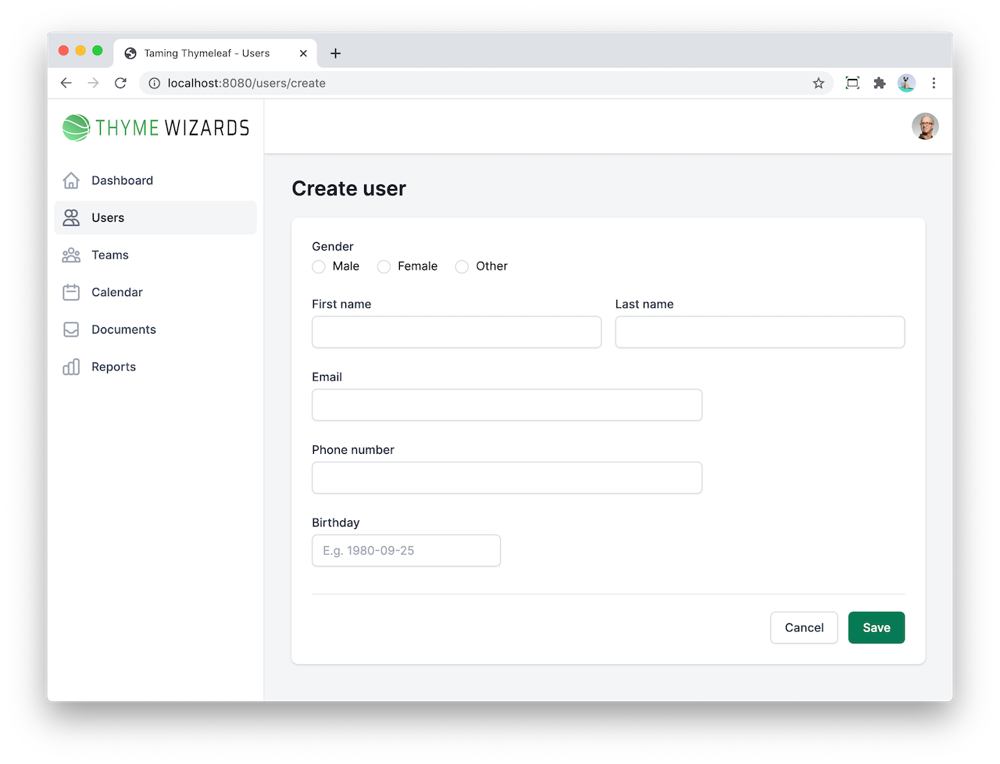
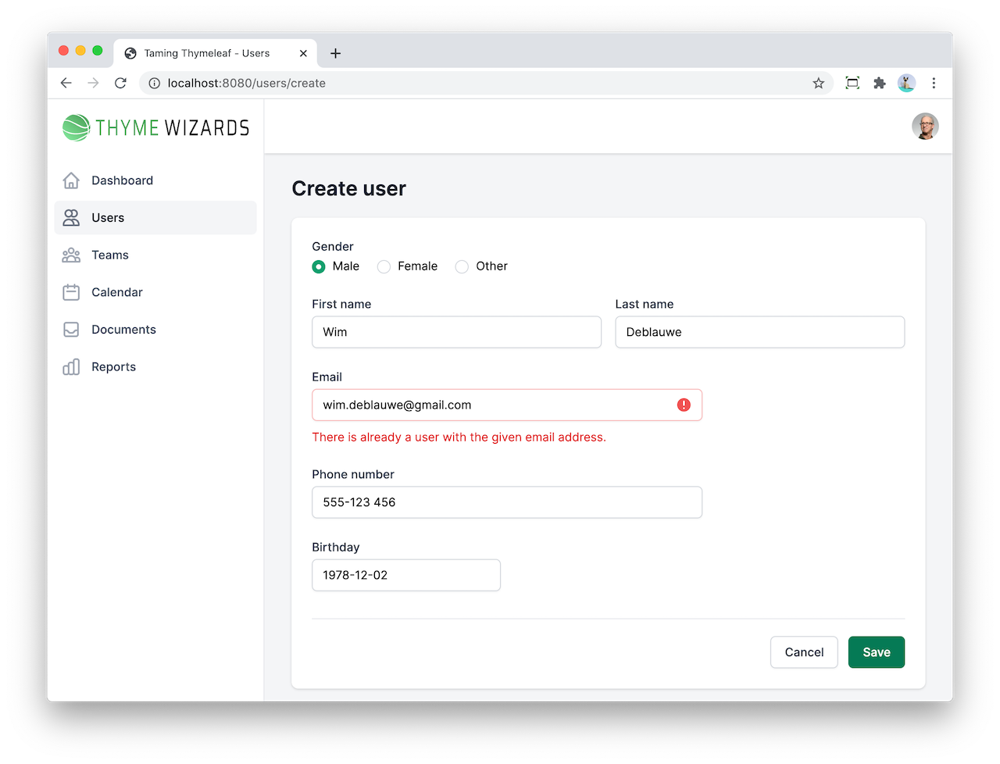
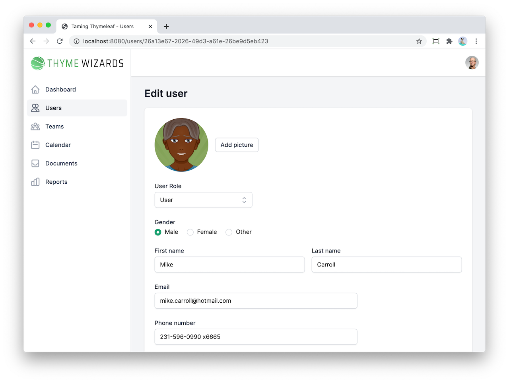
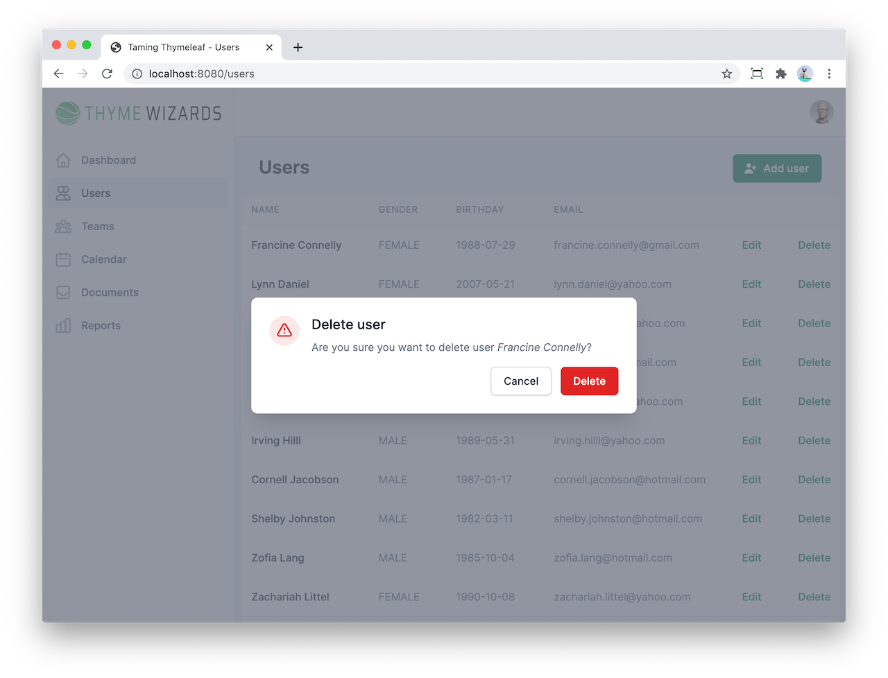
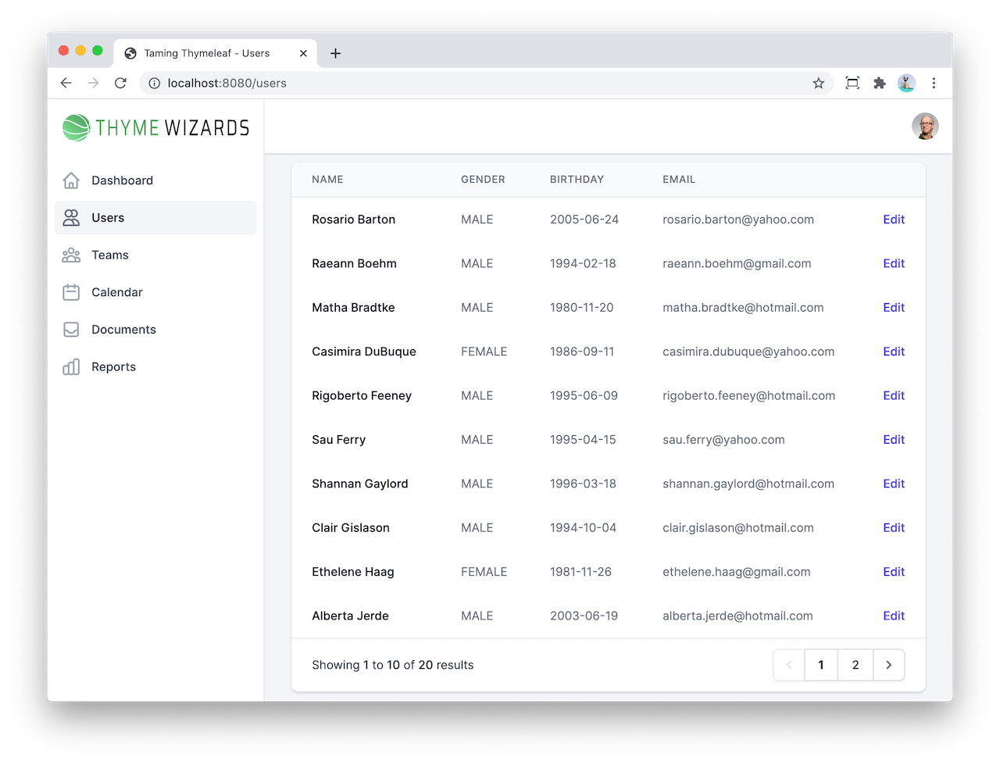
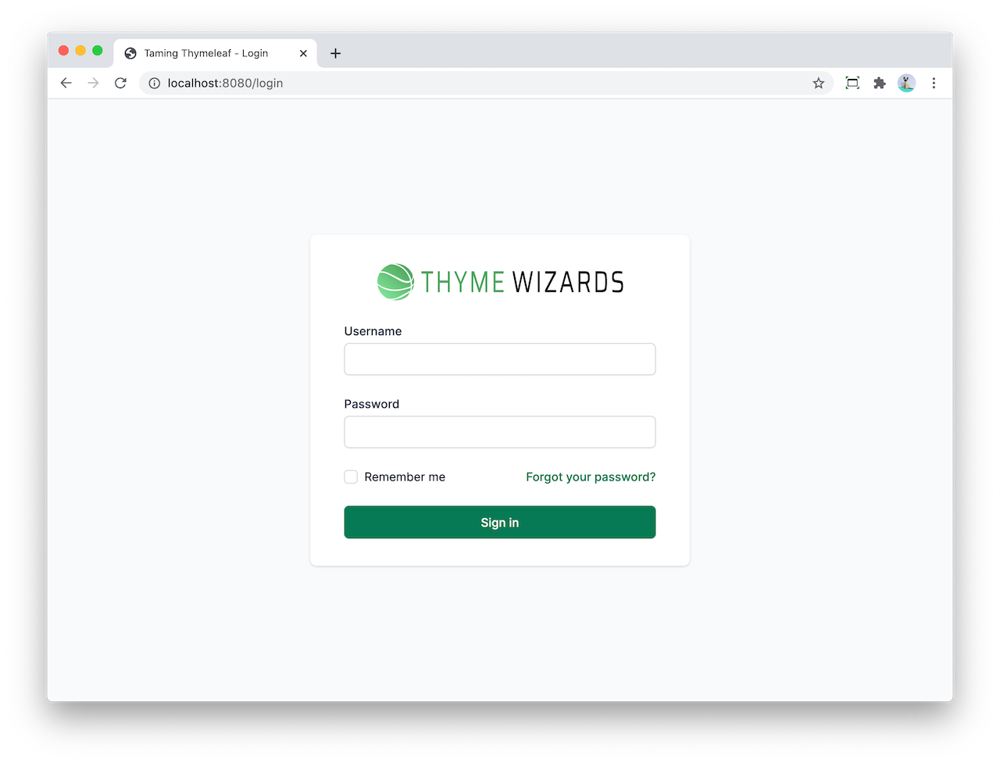
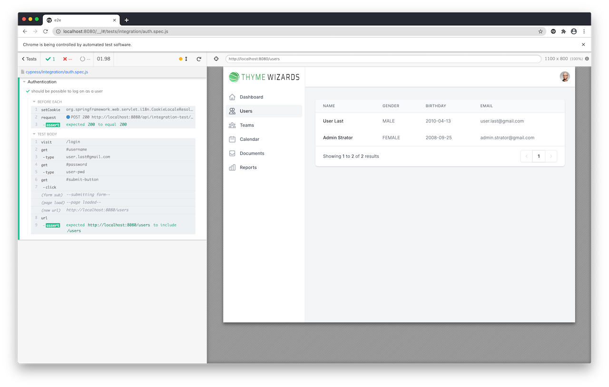
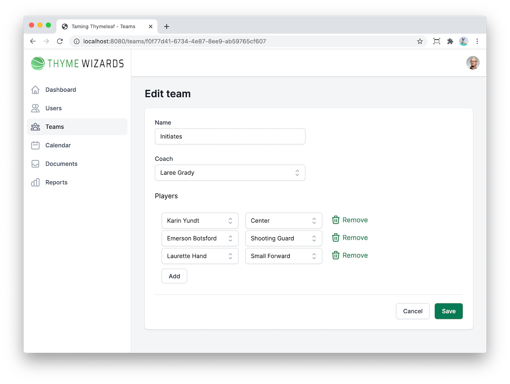

# Taming Thymeleaf Sources

These are the sources for the book 'Taming Thymleaf' which is available at https://leanpub.com/taming-thymeleaf

Each directory matches with how the code is suppose to look like by the end of each chapter in the book.

## About the book

Taming Thymeleaf will learn you about writing web applications with Spring Boot and Thymeleaf in no-time. The book teaches you step-by-step how to get started with those technologies and build a fully fledged web application including security, validation, internationalization, testing, ...

Thymeleaf is an amazing technology for building server-side HTML using the Java eco-system. Combined with Spring Boot, it is really a killer combo for a productive development environment. Learn how to structure your code so your application can evolve for years to come. As HTML will always be there, you can do this without having to re-write your frontend every six months for the latest JavaScript framework.

The application that is built in the book not only functions great. It also looks amazing as it is based on Tailwind UI, beautiful components based on Tailwind CSS.

Super-charge your learning now with Taming Thymeleaf!

## Application screenshots

### Learn to create forms

_Example form to create a user account_

_Validation of form content_

_File upload to set an avatar image on a user_

_Show a modal dialog to confirm deletion of a user_

### Pagination

_Use pagination to allow the user to navigate through a big result set_

### Login/Security

_Custom login page_

### Testing

_Running Cypress tests for end-to-end testing of the Thymeleaf application_

### Dynamic interaction

_Client-side interaction using the [AlpineJS](https://github.com/alpinejs/alpine) JavaScript framework to avoid page reloads when the interaction needs to more dynamic_
